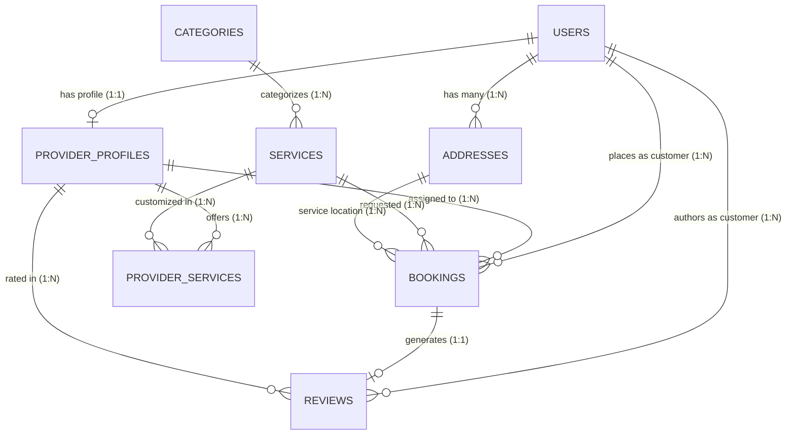

# TrustFix — Comprehensive Project Audit & Development Plan

**Document Version:** 1.0.0  
**Audit Date:** October 2026  
**Repository:** `pushpendrayadav1010/TrustFix`  
**Current Active Branch:** `backend`  

---

## 1. Executive Summary & Audit Overview

TrustFix is an on-demand verified home service platform connecting **Customers**, **Service Providers**, and **Administrators**. The system is built as a decoupled full-stack architecture comprising a **Spring Boot 3.3.4 (Java 21)** REST API backend, a **React 18 + Vite 6** SPA frontend, and a **MySQL 8.0** relational database.

This project audit was conducted in accordance with **Phase 1** requirements without altering existing code. Both the backend test suite (`mvn test`, 84 tests passing) and frontend production bundle build (`npm run build`, Vite v6.4.3) were executed and validated.

### Key Audit Findings
* **Strong Foundations:** The application already possesses clean domain entity separation, Spring Security with stateless JWT Bearer token authentication, custom IDOR protection (`SecurityUtil`), and a responsive custom Vanilla CSS frontend design system.
* **Critical Inconsistencies:** Port configuration mismatches exist between the backend defaults (`8085`), frontend environment settings (`8085`), Docker Compose (`8080`), and documentation (`8080`).
* **Silent Mock Fallbacks in Frontend:** Frontend service layers gracefully fall back to local mock data on network errors, which masks backend failures or permission errors during local testing and demo sessions.
* **Hardcoded Credentials & Dangerous Initialization:** Default admin credentials and hardcoded demo account purge queries are embedded in Java source code (`DataInitializer.java`).
* **Architectural Absence of Payments:** There is currently no payment/transaction model, transaction record entity, or payment gateway abstraction.

---

## 2. Current Folder Structure

```
TrustFix/
├── .git/                                # Git version control repository
├── .gitignore                           # Git ignore definitions
├── .vscode/                             # VS Code project workspace settings
├── README.md                            # High-level project documentation
├── docker-compose.yml                   # Multi-container orchestration (MySQL, Backend, Frontend)
├── test_e2e.ps1                         # PowerShell End-to-End integration test script
├── TRUSTFIX_DEVELOPMENT_PLAN.md         # (This document) Comprehensive Audit & Roadmap
├── database/                            # Intended for SQL schemas / migrations (currently empty)
├── docs/
│   └── API_CONTRACT.md                  # REST API contract specification
├── scratch/
│   └── test_final_trustfix.js           # Node.js 25-point E2E integration test script
├── backend/
│   ├── .env.example                     # Backend environment configuration template
│   ├── .gitignore                       # Backend specific ignore rules
│   ├── Dockerfile                       # Multi-stage Docker container build for Spring Boot
│   ├── mvnw / mvnw.cmd                  # Maven wrapper executables
│   ├── pom.xml                          # Maven build dependencies & plugins
│   └── src/
│       ├── main/
│       │   ├── java/com/trustfix/
│       │   │   ├── TrustfixBackendApplication.java
│       │   │   ├── config/
│       │   │   │   ├── DataInitializer.java
│       │   │   │   └── SecurityConfig.java
│       │   │   ├── controller/
│       │   │   │   ├── AddressController.java
│       │   │   │   ├── AuthController.java
│       │   │   │   ├── BookingController.java
│       │   │   │   ├── CategoryController.java
│       │   │   │   ├── ProviderProfileController.java
│       │   │   │   ├── ProviderServiceController.java
│       │   │   │   ├── ReviewController.java
│       │   │   │   ├── ServiceController.java
│       │   │   │   └── UserController.java
│       │   │   ├── dto/
│       │   │   │   ├── AuthRequest.java
│       │   │   │   ├── AuthResponse.java
│       │   │   │   ├── address/ (AddressRequest, AddressResponse)
│       │   │   │   ├── auth/ (RegisterRequest)
│       │   │   │   ├── booking/ (BookingRequest, BookingResponse)
│       │   │   │   ├── category/ (CategoryRequest, CategoryResponse)
│       │   │   │   ├── mapper/ (AddressMapper, BookingMapper, CategoryMapper, ProviderProfileMapper, ProviderServiceMapper, ReviewMapper, ServiceMapper, UserMapper)
│       │   │   │   ├── provider/ (ProviderLocationResponse, ProviderProfileRequest, ProviderProfileResponse)
│       │   │   │   ├── providerservice/ (ProviderServiceRequest, ProviderServiceResponse)
│       │   │   │   ├── review/ (ReviewRequest, ReviewResponse)
│       │   │   │   ├── service/ (ServiceRequest, ServiceResponse)
│       │   │   │   └── user/ (UserRequest, UserResponse)
│       │   │   ├── entity/
│       │   │   │   ├── Address.java
│       │   │   │   ├── Booking.java
│       │   │   │   ├── BookingStatus.java (Enum: PENDING, CONFIRMED, IN_PROGRESS, COMPLETED, CANCELLED)
│       │   │   │   ├── Category.java
│       │   │   │   ├── ProviderProfile.java
│       │   │   │   ├── ProviderService.java
│       │   │   │   ├── Review.java
│       │   │   │   ├── Service.java
│       │   │   │   ├── User.java
│       │   │   │   ├── UserRole.java (Enum: CUSTOMER, PROVIDER, ADMIN)
│       │   │   │   └── VerificationStatus.java (Enum: PENDING, VERIFIED, REJECTED)
│       │   │   ├── exception/
│       │   │   │   ├── BadRequestException.java
│       │   │   │   ├── ForbiddenException.java
│       │   │   │   ├── GlobalExceptionHandler.java
│       │   │   │   ├── ResourceAlreadyExistsException.java
│       │   │   │   └── ResourceNotFoundException.java
│       │   │   ├── repository/
│       │   │   │   ├── AddressRepository.java
│       │   │   │   ├── BookingRepository.java
│       │   │   │   ├── CategoryRepository.java
│       │   │   │   ├── ProviderProfileRepository.java
│       │   │   │   ├── ProviderServiceRepository.java
│       │   │   │   ├── ReviewRepository.java
│       │   │   │   ├── ServiceRepository.java
│       │   │   │   └── UserRepository.java
│       │   │   ├── security/
│       │   │   │   ├── JwtAuthenticationFilter.java
│       │   │   │   ├── JwtService.java
│       │   │   │   └── SecurityUtil.java
│       │   │   ├── service/
│       │   │   │   ├── AddressService.java
│       │   │   │   ├── AuthService.java
│       │   │   │   ├── BookingService.java
│       │   │   │   ├── CategoryService.java
│       │   │   │   ├── ProviderProfileService.java
│       │   │   │   ├── ProviderServiceService.java
│       │   │   │   ├── ReviewService.java
│       │   │   │   ├── ServiceCatalogService.java
│       │   │   │   └── UserService.java
│       │   │   └── util/
│       │   │       └── HaversineDistanceUtil.java
│       │   └── resources/
│       │       └── application.properties
│       └── test/java/com/trustfix/
│           ├── TrustfixBackendApplicationTests.java
│           ├── controller/ (8 Controller slice test suites)
│           ├── service/ (ProviderProfileServiceTest, UserServiceTest)
│           └── util/ (HaversineDistanceUtilTest)
└── frontend/
    ├── .env                             # Frontend local environment configuration
    ├── .env.example                     # Frontend environment template
    ├── Dockerfile                       # Multi-stage production Nginx container build
    ├── nginx.conf                       # Production Nginx reverse proxy configuration
    ├── package.json                     # NPM packages & build scripts
    ├── vite.config.js                   # Vite tooling configuration
    └── src/
        ├── App.jsx                      # Root application wrapper
        ├── main.jsx                     # Vite DOM entry point
        ├── components/
        │   ├── booking/ (BookingCard, BookingTimeline)
        │   ├── category/ (CategoryCard)
        │   ├── common/ (Button, FeedbackStates, Input, Modal, RatingStars, StatusBadge, VerificationBadge)
        │   ├── dashboard/ (DashboardHeader, Sidebar, StatCard)
        │   ├── footer/ (PublicFooter)
        │   ├── map/ (MapView)
        │   ├── navbar/ (PublicNavbar)
        │   ├── provider/ (ProviderCard)
        │   └── service/ (ServiceCard)
        ├── context/
        │   └── AuthContext.jsx          # User, Provider profile, JWT auth state provider
        ├── layouts/
        │   ├── AdminLayout.jsx          # Admin sidebar portal shell
        │   ├── CustomerLayout.jsx       # Customer sidebar portal shell
        │   ├── ProviderLayout.jsx       # Provider sidebar portal shell
        │   └── PublicLayout.jsx         # Public header & footer shell
        ├── mock/                        # Mock data suites (addresses, bookings, categories, locations, providers, reviews, services, users)
        ├── pages/
        │   ├── admin/ (AdminBookingsPage, AdminCategoriesPage, AdminDashboardPage, AdminProvidersPage, AdminServicesPage, AdminUsersPage)
        │   ├── customer/ (BookServicePage, BookingDetailsPage, CustomerAddressesPage, CustomerDashboard, CustomerProfilePage, MyBookingsPage)
        │   ├── provider/ (AvailabilityPage, BookingRequestsPage, ManagePricingPage, MyServicesPage, ProviderBookingDetailsPage, ProviderDashboard, ProviderProfilePage, ProviderReviewsPage)
        │   └── public/ (BrowseProvidersPage, HomePage, LoginPage, NotFoundPage, PublicProviderProfilePage, RegisterPage, ServiceDetailsPage, ServicesPage)
        ├── routes/
        │   ├── AppRoutes.jsx            # React Router v6 route declarations
        │   └── ProtectedRoute.jsx       # Role-based route guard
        ├── services/
        │   ├── adminService.js
        │   ├── api.js                   # Axios client instance with Bearer interceptor
        │   ├── authService.js
        │   ├── bookingService.js
        │   ├── categoryService.js
        │   ├── locationService.js
        │   ├── providerService.js
        │   ├── reviewService.js
        │   └── userService.js
        ├── styles/                      # Vanilla CSS (variables.css, global.css, components.css, layouts.css, map.css)
        └── utils/                       # Utility helpers (categoryIcons, distance, formatters, imageResolver, validators)
```

---

## 3. Technology Stack & Current Versions

| Tier | Technology | Version | Purpose / Details |
|---|---|---|---|
| **Backend Language** | Java (OpenJDK) | 21 / 26 runtime | Core programming language |
| **Backend Framework** | Spring Boot | 3.3.4 | Web, Data JPA, Security, Actuator |
| **Security & Auth** | Spring Security | 6.x | Stateless filter chain, BCrypt, RBAC |
| **JWT Library** | `io.jsonwebtoken` (JJWT) | 0.12.6 | HS256 HMAC-SHA token creation and parsing |
| **ORM / Persistence** | Hibernate / Spring Data JPA | 6.5.3 | Entity relational mapping, repository interfaces |
| **Database Driver** | `mysql-connector-j` | 8.3.0 | Relational database driver |
| **Database Engine** | MySQL | 8.0+ | Relational persistence |
| **Backend Testing** | JUnit 5, MockMvc, Mockito | Spring Boot Test | Automated unit and web slice testing |
| **Frontend Runtime** | Node.js | v20+ | Frontend build engine |
| **Frontend Framework** | React | 18.3.1 | UI component architecture |
| **Bundler & Dev Server**| Vite | 6.0.1 (6.4.3 build) | Next-generation frontend build tool |
| **Routing** | React Router DOM | 6.28.0 | Client-side declarative routing & route guards |
| **HTTP Client** | Axios | 1.7.9 | Promised-based HTTP client with request/response interceptors |
| **Icons** | Lucide React | 1.35.0 | SVG iconography |
| **Styling** | Vanilla CSS | Custom tokens | CSS variables, glassmorphism, responsive grid & flexbox |

---

## 4. Database Schema & Entities

The relational database consists of 8 primary tables managed through JPA entity declarations with `spring.jpa.hibernate.ddl-auto=update`.

### 4.1 Entity Relationship Diagram



### 4.2 Tables & Relationships Summary

1. **`users`**
   - Columns: `id` (PK, BigInt Auto-Inc), `name` (VarChar 100), `email` (VarChar 100, Unique), `password` (VarChar 255), `phone` (VarChar 20), `role` (VarChar 20, Enum: `CUSTOMER`, `PROVIDER`, `ADMIN`), `is_active` (Boolean), `created_at` (DateTime), `updated_at` (DateTime).
   - Foreign Keys: None.

2. **`provider_profiles`**
   - Columns: `id` (PK), `user_id` (BigInt, Unique FK to `users`), `business_name` (VarChar 150), `bio` (Text), `experience_years` (Int), `verification_status` (VarChar 20, Enum: `PENDING`, `VERIFIED`, `REJECTED`), `document_url` (VarChar 255), `latitude` (Double), `longitude` (Double), `service_radius_km` (Double, default 25.0), `city` (VarChar 100), `state` (VarChar 100), `postal_code` (VarChar 20), `rating` (Double, default 0.0), `review_count` (Int, default 0), `is_available` (Boolean), `created_at` (DateTime), `updated_at` (DateTime).
   - Foreign Keys: `user_id` references `users(id)`.

3. **`categories`**
   - Columns: `id` (PK), `name` (VarChar 100, Unique), `description` (Text), `icon_url` (VarChar 255), `is_active` (Boolean), `created_at` (DateTime), `updated_at` (DateTime).
   - Foreign Keys: None.

4. **`services`**
   - Columns: `id` (PK), `category_id` (BigInt FK), `name` (VarChar 150), `description` (Text), `base_price` (Decimal 10,2), `duration_in_minutes` (Int), `image_url` (VarChar 255), `is_active` (Boolean), `created_at` (DateTime), `updated_at` (DateTime).
   - Foreign Keys: `category_id` references `categories(id)`.

5. **`provider_services`**
   - Columns: `id` (PK), `provider_id` (BigInt FK), `service_id` (BigInt FK), `custom_price` (Decimal 10,2), `is_available` (Boolean), `created_at` (DateTime), `updated_at` (DateTime).
   - Constraints: Unique constraint on `(provider_id, service_id)`.
   - Foreign Keys: `provider_id` references `provider_profiles(id)`, `service_id` references `services(id)`.

6. **`addresses`**
   - Columns: `id` (PK), `user_id` (BigInt FK), `address_line1` (VarChar 255), `address_line2` (VarChar 255), `city` (VarChar 100), `state` (VarChar 100), `postal_code` (VarChar 20), `country` (VarChar 100, default 'India'), `landmark` (VarChar 150), `latitude` (Double), `longitude` (Double), `is_default` (Boolean), `created_at` (DateTime), `updated_at` (DateTime).
   - Foreign Keys: `user_id` references `users(id)`.

7. **`bookings`**
   - Columns: `id` (PK), `booking_reference` (VarChar 50, Unique, e.g. `TF-B4A1C8D2`), `customer_id` (BigInt FK), `provider_id` (BigInt FK, Nullable initially), `service_id` (BigInt FK), `address_id` (BigInt FK), `booking_date` (Date), `booking_time` (Time), `status` (VarChar 30, Enum: `PENDING`, `CONFIRMED`, `IN_PROGRESS`, `COMPLETED`, `CANCELLED`), `total_amount` (Decimal 10,2), `notes` (Text), `cancellation_reason` (Text), `created_at` (DateTime), `updated_at` (DateTime).
   - Foreign Keys: `customer_id` references `users(id)`, `provider_id` references `provider_profiles(id)`, `service_id` references `services(id)`, `address_id` references `addresses(id)`.

8. **`reviews`**
   - Columns: `id` (PK), `booking_id` (BigInt, Unique FK), `customer_id` (BigInt FK), `provider_id` (BigInt FK), `rating` (Int, 1-5), `comment` (Text), `created_at` (DateTime), `updated_at` (DateTime).
   - Foreign Keys: `booking_id` references `bookings(id)`, `customer_id` references `users(id)`, `provider_id` references `provider_profiles(id)`.

---

## 5. Existing APIs & Contract Catalog

The backend exposes **35 REST endpoints**:

| Controller | HTTP Method | Endpoint Path | Auth Requirement | Description |
|---|---|---|---|---|
| **AuthController** | `POST` | `/api/auth/register` | `PUBLIC` | User registration (Customer or Provider) |
| | `POST` | `/api/auth/login` | `PUBLIC` | User authentication returning JWT token & user info |
| **UserController** | `POST` | `/api/users` | `ROLE_ADMIN` | Direct user account creation |
| | `GET` | `/api/users/{id}` | `AUTHENTICATED (Self/Admin)` | Fetch user profile by ID |
| | `GET` | `/api/users/email/{email}` | `AUTHENTICATED (Self/Admin)` | Query user profile by email |
| | `GET` | `/api/users/role/{role}` | `ROLE_ADMIN` | List all users with a specific role |
| | `PUT` | `/api/users/{id}` | `AUTHENTICATED (Self/Admin)` | Update user name, phone, password, role |
| | `DELETE` | `/api/users/{id}` | `ROLE_ADMIN` | Delete user account |
| **ProviderProfileController** | `POST` | `/api/providers/user/{userId}` | `AUTHENTICATED (Self/Admin)` | Create provider profile for user |
| | `POST` | `/api/providers?userId=...` | `AUTHENTICATED (Self/Admin)` | Alternate create provider profile |
| | `GET` | `/api/providers/{id}` | `PUBLIC` | Get provider profile by provider ID |
| | `GET` | `/api/providers/user/{userId}` | `PUBLIC` | Get provider profile by user ID |
| | `GET` | `/api/providers/verified` | `PUBLIC` | List all verified providers |
| | `GET` | `/api/providers/available` | `PUBLIC` | List verified and currently available providers |
| | `GET` | `/api/providers/nearby` | `PUBLIC` | Spatial Haversine search (`lat`, `lng`, `radiusKm`, `serviceId`) |
| | `PUT` | `/api/providers/{id}` | `AUTHENTICATED (Self/Admin)` | Update provider business details & availability |
| | `PUT` | `/api/providers/{id}/verify` | `ROLE_ADMIN` | Approve or reject provider verification |
| **CategoryController** | `POST` | `/api/categories` | `ROLE_ADMIN` | Create new category |
| | `GET` | `/api/categories` | `PUBLIC` | List all categories |
| | `GET` | `/api/categories/active` | `PUBLIC` | List active categories |
| | `GET` | `/api/categories/{id}` | `PUBLIC` | Get category by ID |
| | `GET` | `/api/categories/name/{name}` | `PUBLIC` | Get category by name |
| | `PUT` | `/api/categories/{id}` | `ROLE_ADMIN` | Update category details |
| | `PUT` | `/api/categories/{id}/deactivate` | `ROLE_ADMIN` | Soft-deactivate category |
| | `DELETE` | `/api/categories/{id}` | `ROLE_ADMIN` | Delete category |
| **ServiceController** | `POST` | `/api/services/category/{categoryId}` | `ROLE_ADMIN` | Create service in category |
| | `POST` | `/api/services?categoryId=...` | `ROLE_ADMIN` | Alternate create service |
| | `GET` | `/api/services` | `PUBLIC` | List all services |
| | `GET` | `/api/services/active` | `PUBLIC` | List active services |
| | `GET` | `/api/services/{id}` | `PUBLIC` | Get service by ID |
| | `GET` | `/api/services/category/{categoryId}` | `PUBLIC` | List services by category ID |
| | `PUT` | `/api/services/{id}` | `ROLE_ADMIN` | Update service pricing & details |
| | `PUT` | `/api/services/{id}/deactivate` | `ROLE_ADMIN` | Soft-deactivate service |
| | `DELETE` | `/api/services/{id}` | `ROLE_ADMIN` | Delete service |
| **ProviderServiceController** | `POST` | `/api/provider-services/provider/{pId}/service/{sId}` | `AUTHENTICATED (Provider/Admin)` | Link service to provider catalog with custom price |
| | `GET` | `/api/provider-services/provider/{providerId}` | `PUBLIC / AUTH` | List all services offered by provider |
| | `GET` | `/api/provider-services/service/{serviceId}` | `PUBLIC` | List all providers offering a specific service |
| | `PUT` | `/api/provider-services/provider/{pId}/service/{sId}/price` | `AUTHENTICATED (Provider/Admin)` | Update custom price for offered service |
| | `DELETE` | `/api/provider-services/provider/{pId}/service/{sId}` | `AUTHENTICATED (Provider/Admin)` | Remove service from provider offering |
| **AddressController** | `POST` | `/api/addresses/user/{userId}` | `AUTHENTICATED (Self/Admin)` | Add address for user |
| | `POST` | `/api/addresses?userId=...` | `AUTHENTICATED (Self/Admin)` | Alternate address creation |
| | `GET` | `/api/addresses/user/{userId}` | `AUTHENTICATED (Self/Admin)` | Get all addresses for user |
| | `GET` | `/api/addresses/user/{userId}/default` | `AUTHENTICATED (Self/Admin)` | Get default address for user |
| | `GET` | `/api/addresses/{id}` | `AUTHENTICATED (Owner/Admin)` | Get address by ID |
| | `PUT` | `/api/addresses/{id}` | `AUTHENTICATED (Owner/Admin)` | Update address |
| | `PUT` | `/api/addresses/{id}/default` | `AUTHENTICATED (Owner/Admin)` | Set address as default |
| | `DELETE` | `/api/addresses/{id}` | `AUTHENTICATED (Owner/Admin)` | Delete address |
| **BookingController** | `POST` | `/api/bookings` | `AUTHENTICATED (Customer/Admin)` | Create service booking request |
| | `GET` | `/api/bookings/{id}` | `AUTHENTICATED (Customer/Provider/Admin)` | Get booking by ID |
| | `GET` | `/api/bookings/reference/{ref}` | `AUTHENTICATED (Customer/Provider/Admin)` | Get booking by reference code |
| | `GET` | `/api/bookings/customer/{customerId}` | `AUTHENTICATED (Customer/Admin)` | List bookings for customer |
| | `GET` | `/api/bookings/provider/{providerId}` | `AUTHENTICATED (Provider/Admin)` | List bookings for provider |
| | `GET` | `/api/bookings/status/{status}` | `ROLE_ADMIN` | List all platform bookings by status |
| | `PUT` | `/api/bookings/{id}/status` | `AUTHENTICATED` | Update booking status according to lifecycle rules |
| | `PUT` | `/api/bookings/{id}/assign-provider` | `ROLE_ADMIN` | Reassign or assign provider to booking |
| **ReviewController** | `POST` | `/api/reviews/booking/{bookingId}` | `AUTHENTICATED (Customer/Admin)` | Submit review for completed booking |
| | `POST` | `/api/reviews` | `AUTHENTICATED (Customer/Admin)` | Alternate review submission |
| | `GET` | `/api/reviews/booking/{bookingId}` | `AUTHENTICATED` | Get review for booking |
| | `GET` | `/api/reviews/provider/{providerId}` | `PUBLIC` | List all reviews for provider |
| | `GET` | `/api/reviews/customer/{customerId}` | `AUTHENTICATED (Self/Admin)` | List all reviews written by customer |

---

## 6. Authentication & Authorization Flow

### 6.1 Authentication Architecture
1. **Registration:** `POST /api/auth/register` creates a user with `active = true`, hashes the password with Spring Security's `BCryptPasswordEncoder`, and assigns role `CUSTOMER` or `PROVIDER`.
2. **Login:** `POST /api/auth/login` verifies credentials via `AuthService.login(email, password)` and generates a signed JWT token containing claims (`id`, `role`, `sub: email`) with expiration (default 24h).
3. **Filter Pipeline:** `JwtAuthenticationFilter` intercepts incoming requests, parses the `Authorization: Bearer <token>` header, verifies the signature using `JwtService.isTokenValid()`, checks if `user.isActive() == true`, and establishes the `SecurityContextHolder` with `ROLE_<ROLE>`.
4. **Ownership Verification (IDOR Defense):** `SecurityUtil` verifies whether the authenticated principal is an `ADMIN` or the rightful owner of the target user, provider profile, address, or booking.

---

## 7. Existing Features Breakdown

* **Authentication & Profiles:**
  * Public registration with role selection (`CUSTOMER` vs `PROVIDER`).
  * JWT login with localStorage storage.
  * Role-based layout redirection (`/customer/*`, `/provider/*`, `/admin/*`).
* **Customer Capabilities:**
  * Browse active service catalog and search providers.
  * Interactive Haversine geolocation map discovery (`/api/providers/nearby`).
  * Multi-address management with default address assignment.
  * Create booking with past-date guard (`bookingDate < now` rejected).
  * Booking lifecycle cancellation (allowed only in `PENDING` or `CONFIRMED` states).
  * Post-service review submission (allowed strictly after booking is `COMPLETED`).
* **Provider Capabilities:**
  * View incoming booking requests.
  * Update booking lifecycle (`PENDING` -> `CONFIRMED` -> `IN_PROGRESS` -> `COMPLETED`).
  * Manage custom pricing on services offered (`/api/provider-services`).
  * Toggle real-time availability (`is_available`).
  * View provider rating, total completed jobs, and customer reviews.
* **Administrator Capabilities:**
  * Review pending provider verifications and approve/reject.
  * Manage service categories (create, update, deactivate, delete).
  * Manage service catalog entries (create, update, deactivate, delete).
  * Oversight of platform bookings filtered by status.
  * User account management and role-based listings.

---

## 8. Missing Features & Functional Gaps

1. **Payment / Transaction Architecture (Phase 7):**
   * Completely missing. No payment records, payment entity, or transaction status tracking.
   * Total amounts are recorded on bookings, but no payment state (`UNPAID`, `PAID`, `REFUNDED`) or payment methods exist.
   * No refund request or processing architecture.
2. **Customer Self-Service Account Deletion:**
   * Currently, `DELETE /api/users/{id}` strictly enforces `if (!securityUtil.isAdmin()) throw new ForbiddenException(...)`. Customers cannot close or delete their own accounts.
3. **Provider Rejection Reason:**
   * `ProviderProfile` has `verificationStatus` (`PENDING`, `VERIFIED`, `REJECTED`), but lacks a `rejection_reason` or notes field explaining why an administrator rejected the application.
4. **Dispute / Complaint Management:**
   * Admin dashboard lacks any complaint/dispute resolution mechanism between customers and providers.
5. **Review Updates, Deletions, and Reporting:**
   * Customers cannot edit or delete their submitted reviews.
   * No review reporting or moderation flagging mechanism for abusive reviews.
6. **Backend Pagination and Filtering:**
   * All list endpoints (`/api/bookings/customer/{id}`, `/api/providers/verified`, `/api/reviews/provider/{id}`) return unbounded lists (`List<T>`).
   * No Spring Data `Pageable` or pagination query params are supported yet.
7. **Password Reset Flow:**
   * No "Forgot Password" or tokenized password reset mechanism.
8. **Real-time Notifications:**
   * No in-app notification entity or alert mechanism when a booking status changes or a new request arrives.
9. **Image / Document File Uploads:**
   * Profile documents and category/service images are stored as static string URLs. There is no multipart file upload endpoint for uploading government IDs or photos directly.
10. **Database Migration Tooling:**
    * No Flyway or Liquibase scripts. The `database/` directory is empty.

---

## 9. Bugs, Inconsistencies & Issues Discovered

| Issue # | Area | Severity | Description |
|---|---|---|---|
| **BUG-01** | Configuration / Port Mismatch | **High** | `application.properties` specifies `server.port=${PORT:8085}`, and `frontend/.env` specifies `http://localhost:8085/api`. However, `README.md`, `API_CONTRACT.md`, `docker-compose.yml`, and `scratch/test_final_trustfix.js` specify `8080`. This creates execution failures if someone follows README or runs docker-compose. |
| **BUG-02** | Data Initialization / Seed Mismatch | **High** | `DataInitializer.java` explicitly deletes demo users (`testcustomer@gmail.com`, `testprovider@gmail.com`) on startup via raw SQL and initializes admin password to `231182157800100950`. However, `test_e2e.ps1` expects `testcustomer@gmail.com` with password `Test@123` and admin with `Admin@123`, causing `test_e2e.ps1` to fail. |
| **BUG-03** | Frontend Mock Fallback | **Medium** | When backend calls fail, frontend services (`bookingService.js`, `providerService.js`, `userService.js`) silently swallow the error and return static mock data. This can mislead users into thinking operations succeeded when the backend rejected them. |
| **BUG-04** | Missing `@Valid` on PUT endpoints | **Medium** | Several controller `PUT` endpoints (`UserController.updateUser`, `AddressController.updateAddress`, `CategoryController.updateCategory`, `ServiceController.updateService`, `ProviderProfileController.updateProviderProfile`) receive `@RequestBody` without the `@Valid` annotation. Bean validation constraints on DTOs are not triggered on updates. |
| **BUG-05** | Insecure BCrypt Check | **Low / Security** | In `UserService.updateUser()`, the method checks `isBCryptHashed(password)` by testing if the string starts with `$2a$` and length == 60. If a client sends an arbitrary 60-char string starting with `$2a$`, it is saved directly without encoding. |
| **BUG-06** | Customer Cannot Delete Account | **Medium** | Requirement Phase 3 Item 3 requires Customer "Account deletion". The current backend restricts all user deletion to Admin. |
| **BUG-07** | Booking Provider ID Handling in Query Param vs Body | **Low** | `BookingController.createBooking` accepts IDs as query parameters (`?customerId=1...`) as well as optional JSON body fields, creating ambiguous precedence if both are passed with differing values. |

---

## 10. Security Audit Findings

1. **Default JWT Secret Fallback:**
   * `application.properties` has `jwt.secret=${JWT_SECRET:TrustFixSecretKeyForJwtAuthentication2026Secure}`. If `JWT_SECRET` is not set in production, the application starts with a publicly known secret key.
   * *Remediation:* Enforce validation on startup in production profiles so a random 256-bit key must be provided.
2. **Hardcoded Admin Password:**
   * `DataInitializer.java` contains fallback password `"231182157800100950"` directly in code.
   * *Remediation:* Read exclusively from `ADMIN_PASSWORD` env variable; if absent in production, generate a secure random one and log it, or fail to start.
3. **CORS Configuration:**
   * Allowed origin patterns include `"https://*.vercel.app"` and `"http://localhost:*"`. While suitable for staging/preview deployments, it should be strictly configurable per environment via `APP_ALLOWED_ORIGINS`.
4. **Rate Limiting:**
   * No rate limiting is configured for `/api/auth/login` or `/api/auth/register`, leaving authentication open to brute force attempts.
5. **Session Invalidation / Logout:**
   * JWT tokens are stateless. `authService.logout()` merely removes the token from the client's `localStorage`. The token remains cryptographically valid until its 24-hour expiration.

---

## 11. Testing Status

### Backend Testing (`mvn test`)
* **Framework:** JUnit 5, Mockito, Spring Boot MockMvc.
* **Test Suites:**
  * `TrustfixBackendApplicationTests`: 1 test (Context Load)
  * `HaversineDistanceUtilTest`: 3 tests
  * `UserServiceTest`: 11 tests
  * `ProviderProfileServiceTest`: 2 tests
  * `UserControllerTest`: 8 tests
  * `AddressControllerTest`: 7 tests
  * `BookingControllerTest`: 12 tests
  * `CategoryControllerTest`: 8 tests
  * `ProviderProfileControllerTest`: 8 tests
  * `ProviderServiceControllerTest`: 5 tests
  * `ReviewControllerTest`: 5 tests
  * `ServiceControllerTest`: 7 tests
* **Results:** **84 tests run, 0 failures, 0 errors, 0 skipped.** Build time ~28s.
* **Missing Backend Tests:** Integration tests connecting to a test database (Testcontainers or H2 in-memory test profile), security authorization slice tests, and validation tests for edge cases.

### Frontend Testing
* **Status:** **0 automated tests.**
* No test runner (such as Vitest or Jest) is configured in `package.json`.
* Only manual browser verification and production compilation (`npm run build`) are currently possible.

### E2E Testing
* `test_e2e.ps1` exists but is out of sync with current database seed accounts.
* `scratch/test_final_trustfix.js` exists as a comprehensive 25-point script, but hardcodes port `8080`.

---

## 12. Documentation Status

* **`README.md`**: Well formatted and detailed, but lists port `8080` instead of configured `8085`.
* **`docs/API_CONTRACT.md`**: Documents requests, responses, and error formats for most endpoints, but references port `8080`.
* **Missing Documentation**:
  * `CONTRIBUTING.md`
  * Architecture & data flow diagrams
  * Database schema reference / ERD documentation
  * Production deployment runbook (Docker / Cloud)

---

## 13. Recommended Phased Implementation Order

Based on the audit, the recommended implementation order follows the user's phases while prioritizing stability and runnable incremental improvements:

### Phase 2: Authentication & Security Hardening
* Align server port across all files (`8080` or `8085` uniformly; recommend standardizing on `8080`).
* Fix `DataInitializer.java` to avoid hardcoding secrets and ensure seed accounts match test expectations.
* Enforce strong password complexity validation (uppercase, lowercase, numbers, special characters) via Bean Validation `@Pattern`.
* Add custom error response formatting for authentication failures.
* Add backend unit & integration tests for authentication edge cases (duplicate email, weak password, invalid credentials).

### Phase 3: Customer Features & Self-Service
* Implement customer self-service account deletion (`DELETE /api/users/{id}` permitted for the user themselves with password verification or status marking).
* Enable customer cancellation reason submission.
* Add validation on address management endpoints (`@Valid` on PUT).
* Remove silent mock fallbacks in customer services so errors are transparently surfaced to the user.

### Phase 4: Provider Features & Workflow
* Add `rejectionReason` and verification audit history to `ProviderProfile`.
* Implement provider dashboard statistics API (total earnings, active jobs, acceptance rate).
* Ensure providers can manage their services and availability reliably without falling back to mock data.
* Add unit and integration tests for provider profile and service pricing workflows.

### Phase 5: Admin Features & Platform Governance
* Add explicit user activation / suspension endpoints (`PUT /api/users/{id}/status?active=true|false`).
* Add provider rejection with reason endpoint (`PUT /api/providers/{id}/reject?reason=...`).
* Add admin platform statistics summary API (total revenue, active customers, verified providers, booking breakdown).
* Add a complaints / dispute model and endpoints if required for marketplace trust.

### Phase 6: Trust & Review System Enhancements
* Implement review update (`PUT /api/reviews/{id}`) and delete (`DELETE /api/reviews/{id}`) with ownership checks.
* Implement review reporting mechanism (`POST /api/reviews/{id}/report`).
* Implement pagination for provider review listings (`Page<ReviewResponse>`).
* Add review unit and controller tests.

### Phase 7: Payment / Transaction Architecture
* Design and create `Payment` entity (`id`, `booking_id`, `amount`, `payment_method`, `transaction_reference`, `status`: `PENDING`, `COMPLETED`, `FAILED`, `REFUNDED`).
* Implement Payment service abstraction with simulated gateway processing.
* Provide payment creation, status verification, transaction history, and refund request flow.
* Add payment controller and tests.

### Phase 8: Security & Code Quality Audit
* Add `@Valid` on all controller update (`PUT`) methods.
* Fix insecure BCrypt check in `UserService`.
* Configure production-grade exception handling for unhandled exceptions.
* Add Spring Security test slice verifying 401/403 across role boundaries.

### Phase 9: Documentation Alignment
* Update `README.md`, `API_CONTRACT.md`, and environment configuration templates to match the unified port and real endpoints.
* Create `CONTRIBUTING.md` and database schema reference.
* Sync `test_e2e.ps1` and `scratch/test_final_trustfix.js`.

### Phase 10: CI / Automated Quality Pipeline
* Add GitHub Actions workflow (`.github/workflows/ci.yml`) to build backend (`mvn test`), build frontend (`npm run build`), and verify project integrity on push and PR.

---

---

## 14. Phase 2 — Authentication & Security Hardening (Completed)

### 14.1 Summary of Completed Tasks

1. **Task 1 — Standardized Backend Port to 8085:**
   - Standardized the TrustFix backend on port `8085` uniformly across `backend/Dockerfile`, `docker-compose.yml`, `docs/API_CONTRACT.md`, `README.md`, `frontend/.env`, `frontend/.env.example`, and all verification scripts.
   - Verified that zero outdated active `8080` references remain in the repository.

2. **Task 2 — Removed Hardcoded Security Secrets:**
   - Enforced dynamic JWT secret loading via `JWT_SECRET` environment variable with mandatory 256-bit (32 byte minimum) secret strength.
   - In production profile (`prod` or `production`), the application halts immediately with clear `IllegalStateException` on startup if `jwt.secret` is missing or insecure.
   - Admin credentials (`ADMIN_EMAIL`, `ADMIN_PASSWORD`) are loaded strictly from the environment; in production, absence of an explicit password prevents insecure default account creation.
   - Documented all security variables with dummy placeholders in `backend/.env.example`.

3. **Task 3 — Strong Password Validation Policy:**
   - Created centralized `PasswordValidator` enforcing minimum 8 characters, at least 1 uppercase letter, 1 lowercase letter, and 1 numeric digit.
   - Applied Bean Validation `@Pattern` and `@Size(min = 8)` to `RegisterRequest`.
   - Created `ChangePasswordRequest` DTO and implemented password change endpoint `PUT /api/users/{id}/password`.
   - Validated password complexity in `AuthService.register()` and `UserService.changePassword()`.
   - Created comprehensive unit tests in `PasswordValidatorTest` covering valid passwords, short passwords, missing uppercase, missing lowercase, missing numbers, and empty strings.

4. **Task 4 — Fixed BCrypt Password Handling:**
   - Eliminated the fragile `isBCryptHashed` string check (length == 60, startsWith `$2a$`).
   - In `UserService.updateUser()`, new passwords are only re-encoded if changed; if null or unchanged, existing hash is safely preserved.
   - Added regression unit tests in `UserServiceTest` validating password hash preservation on profile updates and password changes.

5. **Task 5 — Resolved DataInitializer / E2E Conflict:**
   - Removed destructive SQL `DELETE` queries that previously purged test users on startup.
   - Seeded test accounts (`testcustomer@gmail.com` / `Test@123`, `testprovider@gmail.com` / `Test@123`) and demo catalog conditionally in non-production environments when `app.seed-demo-data=true`.
   - Seeded standard test administrator (`admin@trustfix.com` / `Admin@123`) alongside custom administrator emails in development environments.

6. **Task 6 — Login & Register Rate Limiting:**
   - Implemented `RateLimiter` interface, `InMemoryRateLimiter`, and `RateLimitingFilter` targeting `POST /api/auth/login` and `POST /api/auth/register`.
   - Configurable limits via `app.rate-limit.*` (defaults: 10 login attempts/60s, 5 registrations/60s).
   - Anonymizes client IP addresses using SHA-256 hashing.
   - Returns standard HTTP 429 Too Many Requests with `Retry-After` header and structured JSON error response.
   - Tested rate-limit acquisition, windows, and filter HTTP responses via `InMemoryRateLimiterTest` and `RateLimitingFilterTest`.

7. **Task 7 — CORS Hardening:**
   - Removed overly broad wildcard origin `https://*.vercel.app`.
   - Made allowed origins configurable via `app.cors.allowed-origins` (defaulting to localhost ports `3000` and `5173`).
   - In production profile, strictly restricts allowed origins to explicitly configured hostnames.
   - Configured custom 401 `AuthenticationEntryPoint` and 403 `AccessDeniedHandler` returning clean JSON error responses instead of empty responses.

8. **Task 8 — Authentication & Authorization Verification:**
   - Validated that unauthenticated access to protected endpoints is rejected with HTTP 401 Unauthorized.
   - Verified IDOR safeguards in `SecurityUtil`: customers cannot modify another customer's bookings or addresses; providers cannot view or mutate other providers' profiles or bookings.
   - Verified that admin endpoints (`/api/users/role/**`, `/api/bookings/status/**`) strictly require `ROLE_ADMIN`.
   - Created `SecurityAuthorizationIntegrationTest` asserting authorization boundaries.

### 14.2 Verification & Test Results

* **Backend Tests (`./mvnw test`):**
  - Total tests run: **112**
  - Passing: **112**
  - Failures: **0**
  - Errors: **0**
  - Regressions: **None** (all 84 original tests + 28 new unit/integration tests passing)
* **Frontend Build (`npm run build`):**
  - Built cleanly in 11.04s (`dist/assets/index-CiPUEaCA.css`, `dist/assets/index-wlcbhNJ2.js`).
* **End-to-End Verification (`test_e2e.ps1`):**
  - [1/7] Health check UP (MySQL connection active)
  - [2/7] Catalog active (8 categories, 29 services)
  - [3/7] Verified providers query (3 providers)
  - [4/7] Customer login & booking creation (Ref: TF-095EC304, Status: PENDING)
  - [5/7] Provider login & full lifecycle transition (PENDING -> CONFIRMED -> IN_PROGRESS -> COMPLETED)
  - [6/7] Customer review submission (5 Stars)
  - [7/7] Admin governance metrics query (Active customers & completed platform bookings verified)
  - Status: **ALL 7/7 FLOWS PASSED AND PERSISTED IN MYSQL**

---

## 15. Phase 3 — Customer Features (Completed)

### 15.1 Summary of Completed Tasks

1. **Task 1 — Customer Self-Service Account Deletion / Deactivation:**
   - Updated Spring Security configuration in `SecurityConfig.java`: loosened `DELETE /api/users/**` admin-only wildcard to allow `DELETE /api/users/{id}` for authenticated users, delegating granular authorization to `UserService`.
   - In `UserService.deleteUser(Long id)`, enforced ownership verification via `securityUtil.verifyUserOwnershipOrAdmin(id)`.
   - Prevented deactivation of already inactive accounts (`BadRequestException`).
   - Implemented soft-deactivation (`user.setActive(false)`) for non-admin self-deletion or accounts with relational dependencies (existing bookings or reviews) to maintain database referential integrity and audit trails while immediately revoking login privileges in `AuthService.login()`.
   - Added unit and security integration tests: `deleteUser_Admin_Success`, `deleteUser_CustomerSelfDeactivation_Success`, `deleteUser_CustomerAttemptsToDeleteOther_ThrowsForbiddenException`, `deleteUser_AlreadyInactive_ThrowsBadRequestException`, and `unauthenticatedDelete_Returns401`.

2. **Task 2 — Booking Cancellation Reason Workflow:**
   - Created `CancellationRequest` DTO with `@Size(max = 500, message = "Cancellation reason cannot exceed 500 characters")`.
   - Added `cancellationReason` parameter handling to `BookingController.updateBookingStatus()` and created dedicated `PUT /api/bookings/{id}/cancel` endpoint accepting `@Valid @RequestBody CancellationRequest`.
   - Enforced cancellation restrictions in `BookingService`: customers can only cancel bookings with status `PENDING` or `CONFIRMED`. Reject cancellation attempts when the booking is already `IN_PROGRESS` or `COMPLETED`.
   - Preserved immutability: once cancelled, status and cancellation reason cannot be overridden.
   - Handled whitespace trimming and character limits.

3. **Task 3 — Missing `@Valid` on Update Endpoints:**
   - Added missing `@Valid` annotations to all entity update endpoints:
     - `UserController.updateUser(@PathVariable Long id, @Valid @RequestBody UserRequest request)`
     - `AddressController.updateAddress(@PathVariable Long id, @Valid @RequestBody AddressRequest request)`
     - `CategoryController.updateCategory(@PathVariable Long id, @Valid @RequestBody CategoryRequest request)`
     - `ServiceController.updateService(@PathVariable Long id, @Valid @RequestBody ServiceRequest request)`
     - `ProviderProfileController.updateProviderProfile(@PathVariable Long id, @Valid @RequestBody ProviderProfileRequest request)`
   - Added validation failure test `updateUser_InvalidEmail_Returns400` in `UserControllerTest`.

4. **Task 4 — Customer Address Management & IDOR Enforcement:**
   - Verified that customer addresses cannot be accessed, updated, or deleted by other users (`securityUtil.verifyUserOwnershipOrAdmin()`).
   - In `BookingService.createBooking()`, enforced that the selected address must belong to the customer placing the booking (`address.getUser().getId().equals(customerId)`), preventing address IDOR injection.

5. **Task 5 — Customer Booking Security Hardening:**
   - Prevented price and status tampering: `BookingService.createBooking()` overrides any client-supplied total amount with the verified server-side service price (`service.getBasePrice()`) and forces initial status to `PENDING`.
   - Validated that services must be active (`service.isActive()`) and providers must be verified (`provider.getVerificationStatus() == VerificationStatus.VERIFIED`), rejecting requests on inactive services or unverified providers with HTTP 400 Bad Request.

6. **Task 6 — Service & Category Discovery Review:**
   - Verified active service catalog endpoints (`GET /api/services/active` and `GET /api/categories`) operate securely and reliably for guest and customer browsing.

7. **Task 7 — Customer Booking History Ordering:**
   - Added `findByCustomerIdOrderByCreatedAtDesc(Long customerId)` to `BookingRepository`.
   - Updated `BookingService.getBookingsByCustomerId()` to return bookings ordered by most recent first (`createdAt DESC`), ensuring optimal customer dashboard experience.

8. **Task 8 — Sanitized Customer-Facing Error Handling:**
   - Refactored `GlobalExceptionHandler.handleGenericException()`: replaced unhandled exception details with a generic, safe response message (`"An unexpected server error occurred. Please contact support."`) to eliminate stack trace and internal database leakage.
   - Added SLF4J logger in `GlobalExceptionHandler` to record internal error details securely in backend logs.

9. **Task 9 — Frontend Customer Portal Enhancements:**
   - `frontend/src/services/userService.js`: Added `deleteAccount(userId)` and `changePassword(...)`. Removed silent mock fallbacks that previously masked API failures.
   - `frontend/src/services/bookingService.js`: Added `cancelBooking(id, reason)` with real backend integration; removed silent mock fallback data.
   - `CustomerProfilePage.jsx`: Added "Danger Zone: Deactivate Account" section with warning card and interactive confirmation modal that calls `userService.deleteAccount(user.id)`, signs the user out, and redirects to `/login`.
   - `BookingDetailsPage.jsx`: Enhanced with a prominent cancellation alert banner displaying the booking's `cancellationReason` when cancelled.
   - `MyBookingsPage.jsx`: Enhanced booking cards to display the cancellation reason badge when cancelled, allowing customers to easily review cancellation details.

### 15.2 Verification & Test Results

* **Backend Tests (`./mvnw.cmd test`):**
  - Total tests run: **127**
  - Passing: **127**
  - Failures: **0**
  - Errors: **0**
  - Regressions: **None** (all 112 previous tests + 15 new tests passing)
* **Frontend Build (`npm run build`):**
  - Production build successful with Vite v6.4.3 (0 errors).
* **End-to-End Verification (`test_e2e.ps1`):**
  - All 7/7 core business flows verified passing and persisted in MySQL.
  - Custom customer cancellation with reason flow verified end-to-end via REST API (`PUT /api/bookings/{id}/cancel`).

---

## 16. Audit Conclusion & Sign-Off

> **Status:** Phase 3 Complete. All customer features, security validations, and frontend customer portal enhancements verified. Awaiting instructions for Phase 4.

